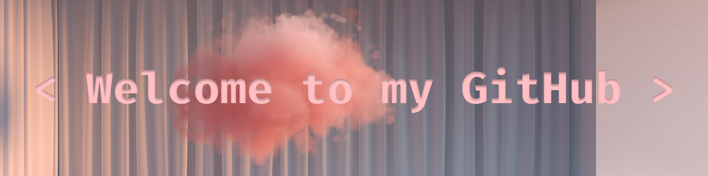

 

    
    
    

- 🙋 Hello! I'm Larissa Natsumi Miyaji, nice to see you here.
- 💻 I'm currently a Junior Front-End Development Student at \<Laboratoria\>.
- 🌱 I’m learning JavaScript, React, HTML5, CSS3 and many more.
- ⚡ Fun fact: I'm a graduated Internationalist who decided to migrate to a completely different area. Here, you can see some of my projects and keep up with my knowledge and skills improvement.
